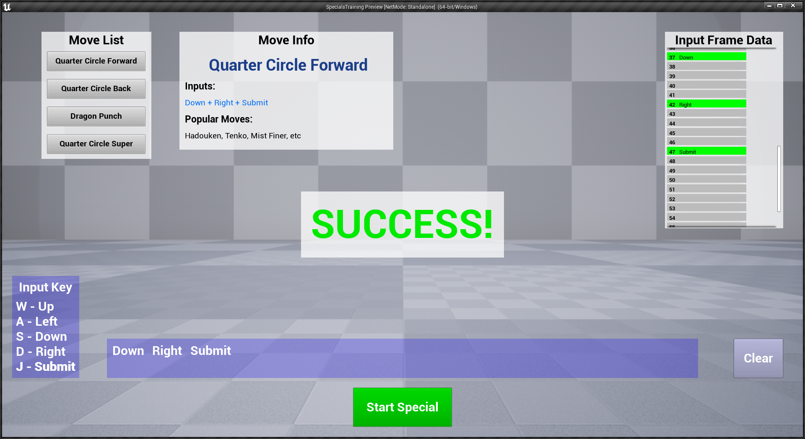

# Fighting Games Special Moves Practicing Tool

## _Overview_

This project is meant to help fighting game players practice their special move inputs. Special move inputs can be hard for many players, so this project aims to help people practice and see where to improve their inputs.

For a better representation of the tool in action, check out the video [HERE](https://www.youtube.com/watch?v=fxJ05env9f4).

### How To Open Project
1. Download the project folder from github.
2. Once you've opened project folder in the file explorer, right click the `SpecialsTraining.uproject` file.
3. Click on the `Generate Visual Studio Project Files` option in the drop down menu. This will generate the VS solution file along with the `Saved` and `Intermediate` folders.
4. Double click the newly created VS solution file. Build and run the project to open the editor.
6. Press play to enjoy.

#### Development

This game was written in C++ and uses Unreal Engine 4. Free use for everyone. MIT License.